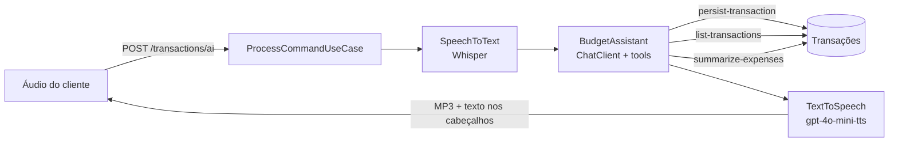

# Assistente Financeiro por Voz com Spring AI

[](https://github.com/lucasgarciarodrigues2011-lgtm/spring-ai-budgeting-assistant/actions/workflows/ci.yml)

API de orçamento em **Spring Boot 4 + Spring AI** que entende comandos de voz. Você grava algo como *"gastei trinta e dois reais na farmácia"*, e a API:

1. transcreve o áudio (Whisper);
2. usa um modelo de linguagem para entender a intenção;
3. chama uma **função real** da aplicação (tool calling) para registrar ou consultar gastos;
4. devolve a resposta em **áudio MP3** (e em texto).

Projeto do desafio **Spring AI** da [DIO](https://www.dio.me/), evoluído a partir do [projeto final da trilha](https://github.com/digitalinnovationone/dio-spring-boot-learning-track/tree/main/05-spring-ai) do expert Poiani.

## Fluxo principal



## O que eu melhorei

### 1. Correção de bug: valores em centavos apareciam como reais
O valor é guardado em centavos, mas o `TransactionOutput` original não dividia por 100: um gasto de **R$ 15,00 voltava como 1500.00**, e o assistente respondia "mil e quinhentos reais". Agora toda conversão passa pela classe `Money` (`domain/Money.java`), e a API e a IA sempre trabalham em reais.

Também mudei a tool para receber o valor **em reais** (`15.90`) em vez de centavos: é assim que as pessoas falam, e o modelo erra menos quando não precisa fazer a conversão.

### 2. Validações antes de salvar
As regras ficam no domínio (`Transaction.create`), então valem tanto para o REST quanto para a IA:

- descrição obrigatória (até 255 caracteres);
- valor maior que zero e até R$ 1.000.000,00 (protege contra transcrições erradas);
- categoria obrigatória;
- data válida e que não esteja no futuro.

Todos os erros voltam de uma vez. Na API REST viram um **422** no padrão Problem Details. Na IA, o Spring AI devolve a mensagem de erro da tool para o modelo, que **explica o problema em voz** em vez de a requisição quebrar.

### 3. Novas tools e consultas financeiras
| Tool | O que faz | Exemplo de comando |
|---|---|---|
| `persist-transaction` | Registra um gasto (agora com data opcional) | "Ontem paguei 80 reais de luz" |
| `list-transactions` | Lista gastos por categoria **e período** (antes era só categoria) | "O que eu gastei no mercado este mês?" |
| `summarize-expenses` | **Nova:** total do período e por categoria, com percentual | "Quanto gastei em setembro? Onde gastei mais?" |

A soma é feita em Java, não pelo modelo: modelos de linguagem erram contas, então a IA só recebe o resultado pronto.

Também ampliei as categorias de 3 para 8: `GROCERIES`, `PHARMA`, `AUTO`, `RESTAURANT`, `TRANSPORT`, `HOUSING`, `LEISURE` e `OTHER`.

### 4. Respostas melhores da IA
O prompt de sistema (`prompts/system-message.st`) virou um **template** que recebe:

- **a data de hoje**: sem ela, o modelo não sabe o que é "ontem" ou "este mês";
- **a lista de categorias com descrição**, para escolher a categoria certa.

Ele também traz regras: não inventar valores, perguntar quando faltar informação, usar a tool de resumo para totais e responder em frases curtas, próprias para virar áudio.

### 5. Organização e endpoints
- O fluxo de voz saiu do controller e foi para um caso de uso (`ProcessCommandUseCase`) que depende de três **portas**: `SpeechToText`, `BudgetAssistant` e `TextToSpeech`. As implementações com Spring AI ficam em `infrastructure/ai`. Isso permitiu testar o fluxo inteiro sem chamar a OpenAI.
- **Novo** `POST /transactions/ai/text`: o mesmo assistente, por texto. Serve para testar a IA sem gravar áudio e sem custo de transcrição e voz.
- O endpoint de voz agora também devolve **o que foi entendido e a resposta em texto** nos cabeçalhos `X-Transcription` e `X-Assistant-Reply`.
- Uma auditoria simples registra em log cada interação: canal, entrada, resposta e tempo de execução.

### 6. Testes automatizados
Os testes rodam **sem chave da OpenAI e sem Docker**, com H2 em memória e dublês para as portas de IA:

- `TransactionTest`: regras do domínio e conversão de moeda;
- `UseCasesTest`: bug dos centavos, data padrão, validações, filtros e resumo;
- `ToolDefinitionsTest`: as tools chegam ao modelo com nome e parâmetros corretos;
- `ProcessCommandUseCaseTest`: fluxo voz → texto → IA → voz, incluindo áudio que não foi entendido;
- `ApiIntegrationTest`: sobe a aplicação inteira e testa os endpoints REST e de IA.

Os testes originais do expert, que chamam a OpenAI de verdade (`*IT.java`), continuam no projeto. Eles só rodam quando a variável `OPENAI_API_KEY` está definida. O **GitHub Actions** roda o build e os testes a cada push.

## Tecnologias

Java 25 · Spring Boot 4.0 · Spring AI 2.0 (OpenAI: `gpt-4o-mini`, `whisper-1`, `gpt-4o-mini-tts`) · Spring Data JPA · MySQL (Docker Compose) · H2 nos testes · JUnit 5, AssertJ, Mockito e MockMvc · Gradle · GitHub Actions

## Como executar

Pré-requisitos: **Java 25**, **Docker** (para o MySQL) e uma **chave da OpenAI**.

```bash
export OPENAI_API_KEY="sua_chave_aqui"   # no Windows (PowerShell): $env:OPENAI_API_KEY="sua_chave_aqui"
./gradlew bootRun                        # o Spring sobe o MySQL do compose.yml automaticamente
```

> No Linux/macOS, se aparecer "permission denied", rode `chmod +x gradlew` uma vez. No Windows, use `gradlew.bat`.

Para rodar só os testes (não precisa de chave nem de Docker):

```bash
./gradlew test
```

## Como testar o fluxo principal

**1. Pelo assistente em texto** (mais rápido e barato):

```bash
curl -X POST http://localhost:8080/transactions/ai/text \
  -H "Content-Type: application/json" \
  -d '{"message": "Gastei 32 reais e 90 centavos na farmácia"}'

curl -X POST http://localhost:8080/transactions/ai/text \
  -H "Content-Type: application/json" \
  -d '{"message": "Quanto eu gastei este mês e onde gastei mais?"}'
```

**2. Pelo fluxo de voz completo** (grave um áudio curto no celular):

```bash
curl -X POST http://localhost:8080/transactions/ai \
  -F "file=@meu-audio.m4a" \
  -D - -o resposta.mp3
```

A resposta falada fica em `resposta.mp3`, e os cabeçalhos mostram a transcrição e o texto da resposta. A pasta `src/test/resources/audio` tem gravações de exemplo.

**3. Pelos endpoints REST:**

```bash
# registrar (valor em reais; data opcional)
curl -X POST http://localhost:8080/transactions -H "Content-Type: application/json" \
  -d '{"description": "Almoço", "category": "RESTAURANT", "amount": 42.50}'

# listar com filtros opcionais
curl "http://localhost:8080/transactions?category=RESTAURANT&from=2026-09-01&to=2026-09-30"

# resumo do mês atual
curl http://localhost:8080/transactions/summary
```

Exemplo de erro de validação (`422`):

```json
{
  "title": "Transação inválida",
  "status": 422,
  "detail": "A transação tem dados inválidos.",
  "errors": ["A descrição é obrigatória.", "O valor deve ser maior que zero."]
}
```

### Endpoints

| Método | Rota | Descrição |
|---|---|---|
| `POST` | `/transactions/ai` | Áudio (multipart, campo `file`) → resposta em MP3 |
| `POST` | `/transactions/ai/text` | **Novo.** Texto → resposta em texto |
| `POST` | `/transactions` | Registra um gasto |
| `GET` | `/transactions?category=&from=&to=` | **Novo.** Lista com filtros opcionais (sem período: mês atual) |
| `GET` | `/transactions/summary?from=&to=` | **Novo.** Total do período e por categoria |
| `GET` | `/transactions/{category}` | Lista por categoria (mantido do projeto base) |

## Estrutura

```
src/main/java/dio/budgeting
├── domain/            # Transaction (com validações), Money, Category, TransactionRepository
├── application/       # Casos de uso, que também são as tools da IA
│   └── assistant/     # Fluxo do assistente e portas (SpeechToText, BudgetAssistant, TextToSpeech)
└── infrastructure/
    ├── ai/            # Implementações com Spring AI (ChatClient, Whisper, TTS)
    ├── http/          # Controllers e tratamento de erros
    ├── persistence/   # JPA
    └── config/        # Clock (fuso horário de "hoje")
```

## O que aprendi

- **A IA não substitui a regra de negócio.** O modelo escolhe *qual* função chamar e com quais dados, mas quem valida, grava e soma é o código Java. Deixar a soma com o modelo seria pedir para errar.
- **Tool calling é um contrato.** O nome, a descrição e os parâmetros de cada `@Tool` são o que o modelo lê para decidir. Descrições claras ("valor em reais, ex.: 15.90") mudaram a qualidade do resultado.
- **Contexto importa.** Sem a data de hoje no prompt, "ontem" não significa nada para o modelo.
- **Separar a IA atrás de interfaces** deixou o fluxo testável sem gastar créditos da OpenAI e sem depender de rede no CI.
- **Erros de tool viram parte da conversa:** uma exceção bem escrita no domínio chega ao modelo, e ele consegue explicar o problema para a pessoa.
